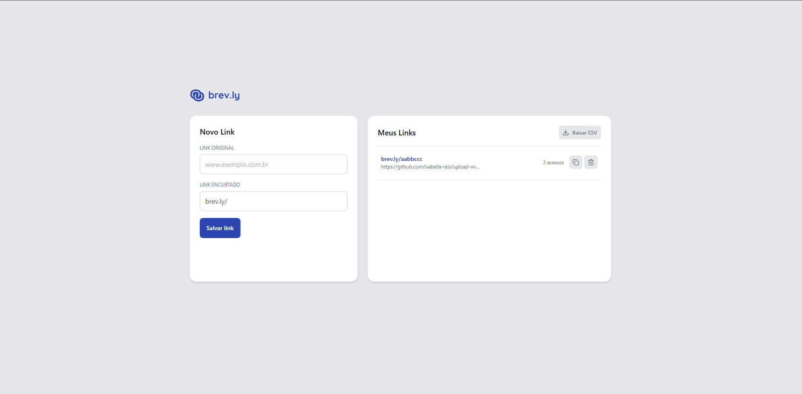
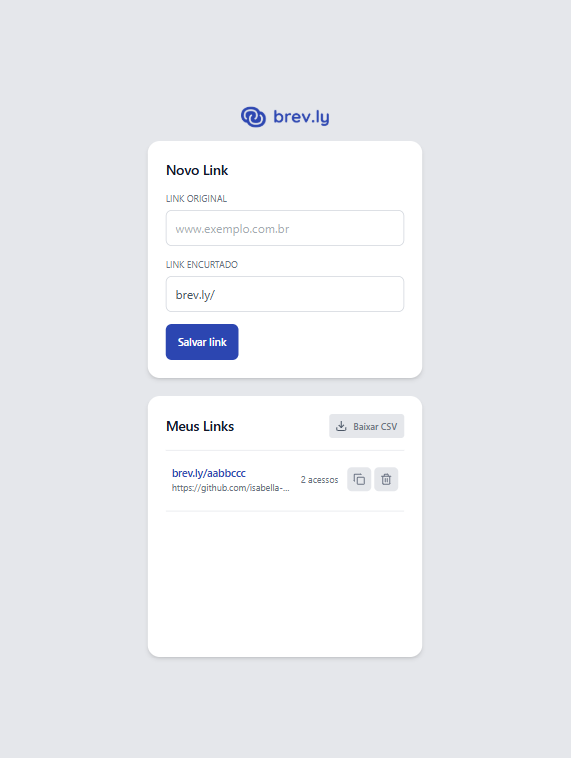

# Brev.ly - Front-end

> Interface SPA para encurtamento de URLs, criada com React + Vite + TailwindCSS

## ✨ Visão Geral

Este é o front-end da aplicação **Brev.ly**, um encurtador de links completo, responsivo e fiel ao design no Figma. Ele consome uma API para permitir que usuários criem, listem, excluam e monitorem links encurtados.

## 📄 Funcionalidades

-

## ⚖️ Requisitos atendidos

-

## 🚀 Tecnologias

- [React](https://reactjs.org)
- [Vite](https://vitejs.dev)
- [TypeScript](https://www.typescriptlang.org/)
- [TailwindCSS](https://tailwindcss.com)
- [React Router DOM](https://reactrouter.com/)
- [Zod](https://github.com/colinhacks/zod)
- [Lucide React Icons](https://lucide.dev/)

## 🚧 Instalação local

```bash
# Acesse a pasta 'web'
cd web

# Instale as dependências
npm install

# Crie um arquivo .env.local baseado no .env.example
cp .env.example .env.local

# Execute o projeto localmente
npm run dev
```

## ♻ Estrutura de Diretórios

```
src/
├── assets/            # Imagens e logos
├── components/        # Componentes reutilizáveis
├── http/              # Consumo da API
├── pages/             # Páginas (redirect, not found)
├── styles/            # CSS e Tailwind config
├── utils/             # Utilitários diversos
├── app.tsx            # Definição de rotas
└── main.tsx           # Entry point
```

## 🔐 Variáveis de Ambiente

Crie um arquivo `.env.local` na pasta `web/` com base no modelo abaixo:

```dotenv
VITE_FRONTEND_URL=http://localhost:5173
VITE_BACKEND_URL=http://localhost:3333
```

## 📹 Preview (opcional)




---

## 📄 Licença

Este projeto é de uso educacional para fins de desafio prático.

Feito com ❤️ por Isabella Reis

